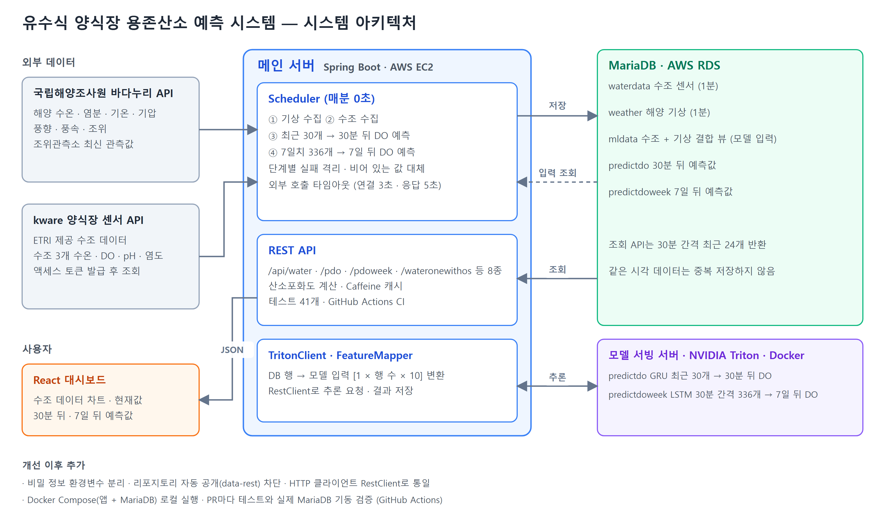
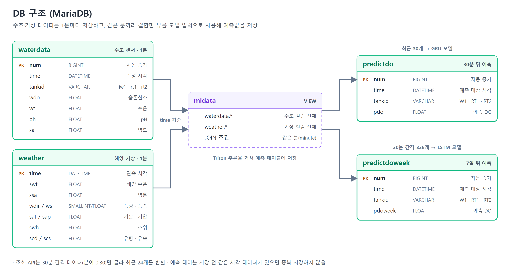

# 유수식 양식장 용존산소 예측 시스템 — 백엔드

[](https://github.com/beefplz/water/actions/workflows/ci.yml)

양식장 수조 센서와 외부 해양 기상 데이터를 1분마다 수집하고, 딥러닝 모델로 **30분 뒤와 7일 뒤의 용존산소(DO)**를 예측해 제공하는 Spring Boot 서버입니다.

- 한밭대학교 컴퓨터공학과 Cellfie팀 × ETRI 농축해양수산지능연구센터 산학연계 캡스톤디자인 (2024)
- 논문: 「기상데이터를 활용한 유수식 양식장 용존산소량 예측 시스템 구현」, 2024년 대한전자공학회 하계학술대회
- 팀 저장소(프론트엔드, 학습 코드, 보고서 포함): [HBNU-SWUNIV/come-capstone24-cellfie-team](https://github.com/HBNU-SWUNIV/come-capstone24-cellfie-team)

## 담당 역할

**백엔드 전체 (메인 서버, 모델 서빙 서버)**

- Spring Boot 메인 서버: 외부 API 수집 스케줄러, 예측 요청, DB 설계, REST API
- 모델 서빙 서버: 학습된 PyTorch 모델을 Triton Inference Server로 배포하고 메인 서버와 연동
- AWS EC2/RDS 배포

프로젝트 종료 후에는 이 저장소에서 보안, 안정성, 테스트, 배포 자동화를 개선했습니다. ([개선 내역](#프로젝트-이후-개선))

## 왜 만들었나

유수식 양식장은 바닷물을 그대로 끌어와 쓰기 때문에 **유입수의 용존산소가 부족하면 집단 폐사**로 이어질 수 있습니다. 그래서 대부분 산소를 상시 공급하는데, 필요 없을 때도 공급해 비용이 커집니다.

용존산소가 떨어질 시점을 미리 알면 **필요할 때만 산소를 공급**할 수 있습니다. 유입수는 외부 바다의 영향을 받으므로, 수조 센서 데이터뿐 아니라 **해양 기상 데이터(수온, 염분, 풍향, 조위 등)를 함께 학습**시켰습니다.

| 2시간 뒤 예측 (GRU) | 양식장 데이터만 | 양식장 + 기상 데이터 |
|---|---|---|
| MAE | 0.2579 | **0.2397** |
| MSE | 0.2143 | **0.1362** (약 36% 감소) |

<sub>출처: 팀 논문 표 3</sub>

## 시스템 구성



### 수집과 예측 흐름 (매분 0초)

| 단계 | 내용 |
|---|---|
| 1. 기상 수집 | 국립해양조사원 조위관측소 최신 관측값 저장 |
| 2. 수조 수집 | kware 액세스 토큰 발급 → 수조 3개(iw1, rt1, rt2)의 수온, DO, pH, 염도 저장 |
| 3. 단기 예측 | 최근 30개 데이터 → Triton `predictdo`(GRU) → **30분 뒤** DO 저장 |
| 4. 장기 예측 | 최근 7일(30분 간격 336개) → Triton `predictdoweek`(LSTM¹) → **7일 뒤** DO 저장 |

<sub>¹ 팀 저장소의 학습 코드(`longterm_train.py`) 기준</sub>

- 단계마다 예외를 격리해 **한 단계가 실패해도 나머지는 계속 실행**됩니다.
- 센서 값이 비어 있으면 가장 최근 저장값으로 채우고, 수조 데이터가 아예 없으면 1개월(없으면 3개월) 전 같은 시각 데이터로 대체합니다.
- 모든 외부 호출에 연결 3초, 응답 5초(추론 10초) 타임아웃을 적용했습니다.

## 기술 스택

| 구분 | 사용 기술 |
|---|---|
| 서버 | Java 17, Spring Boot 3.2, Spring Data JPA, RestClient, Caffeine |
| DB | MariaDB |
| 모델 서빙 | NVIDIA Triton Inference Server (PyTorch backend) |
| 테스트 | JUnit 5, Mockito, MockRestServiceServer, H2 |
| 인프라 | Docker, Docker Compose, GitHub Actions, AWS EC2/RDS |

## API

모든 API는 `GET` 요청이며 `tankid`(`iw1`, `rt1`, `rt2`)가 필요합니다. 시간은 `yyyyMMddHHmm` 형식 문자열입니다.

| 경로 | 설명 | 프론트엔드 사용 |
|---|---|---|
| `/api/water` | 최근 12시간 수조 데이터 (30분 간격 24개) | ✅ 차트 |
| `/api/wateronewithos` | 최신 수조 데이터 + 산소포화도(%) | ✅ 현재값 표시 |
| `/api/pdo` | 30분 뒤 DO 예측값 (30분 간격 24개) | ✅ 차트 |
| `/api/pdoweek` | 7일 뒤 DO 예측값 (30분 간격 24개) | ✅ 주간 예측 |
| `/api/waterone` | 최신 수조 데이터 | |
| `/api/waterwithos` | 최근 12시간 수조 데이터 + 산소포화도 (30분 캐시) | |
| `/api/mldata` | 모델 입력용 수조 + 기상 결합 데이터 | |

응답 예시 (`/api/wateronewithos?tankid=iw1`)

```json
{"num": 1, "time": "202609271158", "tankid": "iw1", "wdo": 8.0, "wt": 20.0, "ph": 7.9, "sa": 31.0, "os": 87.91}
```

산소포화도(`os`)는 수온별 포화 용존산소량 표(10~30℃)로 계산하며, 표 범위 밖 수온이면 `null`입니다.

## 프로젝트 이후 개선

캡스톤 종료 후 코드를 다시 점검하며 발견한 문제를 PR 단위로 개선했습니다.

| PR | 문제 | 해결 | 결과 |
|---|---|---|---|
| [#1](https://github.com/beefplz/water/pull/1) | DB 비밀번호, API 키가 코드와 설정 파일에 그대로 커밋됨 | `@ConfigurationProperties` + 환경변수/git 제외 파일로 분리, 누락 시 기동 실패하도록 검증 | 저장소에 비밀 정보 없음 |
| [#1](https://github.com/beefplz/water/pull/1) | 외부 API 하나가 실패하면 그 회차 수집·예측 전체가 중단, 타임아웃 없음 | 단계별 예외 격리, 모든 외부 호출에 타임아웃, `fixedRate` → `cron` | 부분 장애에도 나머지 단계 정상 동작 |
| [#1](https://github.com/beefplz/water/pull/1) | 주간 예측 중복 검사가 30분 예측의 시각을 참조하는 버그 | 자기 목표 시각으로 검사하도록 수정 | 테스트로 재발 방지 |
| [#2](https://github.com/beefplz/water/pull/2) | `spring-boot-starter-data-rest`로 **모든 리포지토리가 인증 없이 공개** (`POST`, `DELETE`까지 가능) | 의존성 제거 (컨트롤러에 직접 만든 API만 사용) | 외부 조작 차단, 404 확인 테스트 |
| [#2](https://github.com/beefplz/water/pull/2) | HTTP 클라이언트 3종류 혼용, 수조 3개 × 모델 2개로 같은 코드 6번 반복 | `RestClient` + Jackson으로 통일, `TritonClient`·`FeatureMapper` 분리 | 수집·예측 코드 약 920줄 → 520줄 |
| [#3](https://github.com/beefplz/water/pull/3) | 수온이 10~30℃ 밖이면 NPE로 산소포화도 API가 500 에러 (목록 API는 한 건만 섞여도 전체 실패) | 계산 불가 시 `null` 반환 | 겨울철 수온에도 정상 응답 |
| [#3](https://github.com/beefplz/water/pull/3) | actuator `caches` 엔드포인트가 공개되어 누구나 캐시를 비울 수 있음 | 공개 엔드포인트를 `health`, `info`로 제한 | |
| [#4](https://github.com/beefplz/water/pull/4) | 로컬에서 미리 빌드한 jar가 있어야 Docker 이미지 생성 가능, 테스트 자동화 없음 | 멀티스테이지 Dockerfile, docker-compose, GitHub Actions CI | PR마다 테스트 + 실제 MariaDB 기동 검증 |

### 리팩터링을 안전하게 한 방법

구조를 크게 바꾸기 전에 **특성 테스트(characterization test)**를 먼저 작성했습니다. 로컬에 가짜 Triton 서버를 띄워 실제로 전송되는 요청 본문(입력 배열, 0~359도 전체 풍향의 16방위 변환 결과)과 예측 결과를 기록하고, 리팩터링 후에도 같은 테스트가 통과하는 것으로 **동작이 바뀌지 않았음**을 확인했습니다.

## 테스트

`./gradlew test` — 41개

| 종류 | 대상 |
|---|---|
| 단위 테스트 | 산소포화도 계산, 16방위 변환, 스케줄러 단계 격리, 서비스 로직 |
| 외부 API 연동 | `MockRestServiceServer`로 khoa/kware 요청 URL·본문과 응답 변환, 대체값 처리 |
| 특성 테스트 | 가짜 Triton 서버로 추론 요청 형식과 예측 결과 고정 |
| 웹 계층 | `@WebMvcTest`로 API 주소와 응답 JSON 형식 고정 |
| 통합 | H2로 애플리케이션 전체 기동, 캐시 동작, 리포지토리·관리 엔드포인트 미공개 확인 |

GitHub Actions에서는 테스트 후 **Docker Compose로 앱과 MariaDB를 실제로 띄워** 헬스 체크와 주요 API 응답까지 확인합니다. H2로는 검증할 수 없는 MariaDB 전용 쿼리를 이 단계에서 검증합니다.

## 실행 방법

### Docker Compose (권장)

```bash
cp .env.example .env
docker compose up -d --build
curl http://localhost:7355/actuator/health
```

- MariaDB와 앱이 함께 뜨며, DB 스키마는 `docker/mariadb/init`에서 자동으로 만들어집니다.
- 기본값은 **수집 스케줄러 꺼짐**입니다. 실제 API 키와 Triton 서버가 있을 때 `.env`에서 `APP_SCHEDULING_ENABLED=true`로 켭니다.

### IDE에서 실행

`secrets.example.properties`를 `secrets.properties`로 복사해 값을 채운 뒤 `WaterApplication`을 실행합니다. (`secrets.properties`는 git에 올라가지 않습니다.)

| 환경변수 | 설명 |
|---|---|
| `DB_URL`, `DB_USERNAME`, `DB_PASSWORD` | MariaDB 접속 정보 |
| `KHOA_KEY` | 국립해양조사원 바다누리 API 키 |
| `KWARE_KEY` | kware 양식장 센서 API 키 |
| `TRITON_URL` | Triton 서버 주소 (예: `http://localhost:8000`) |
| `APP_SCHEDULING_ENABLED` | 수집 스케줄러 사용 여부 (기본 `true`) |

## DB 구조



## 프로젝트 구조

```
src/main/java/org/capstone/water
├── apireader/      # 외부 API 수집, Triton 추론, 스케줄러
├── config/         # 설정 바인딩, HTTP 클라이언트, 스케줄링
├── controller/     # REST API
├── service/        # 조회 로직, 산소포화도 계산
└── repository/     # JPA 엔티티, 리포지토리
docker/mariadb/init # 초기 스키마 (mldata 뷰 포함)
```

> `mldata` 뷰는 운영 DB의 원본 정의가 남아 있지 않아, 엔티티 컬럼과 수집 시각 규칙을 바탕으로 "수조 데이터 + 같은 분의 기상 데이터" 조인으로 재구성했습니다.
